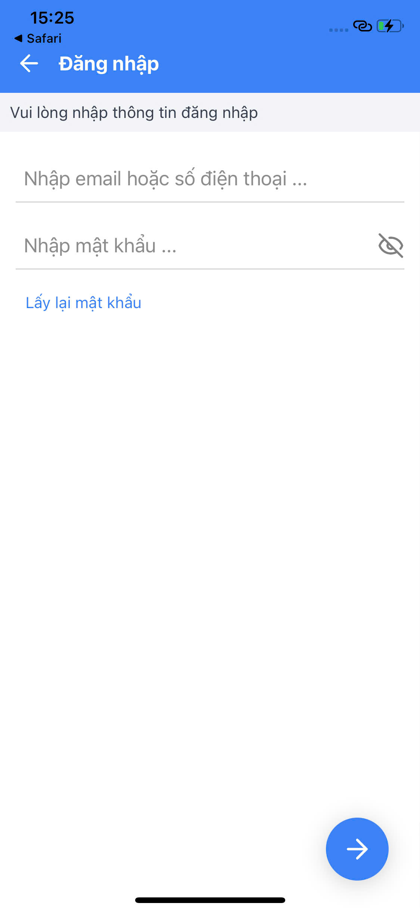
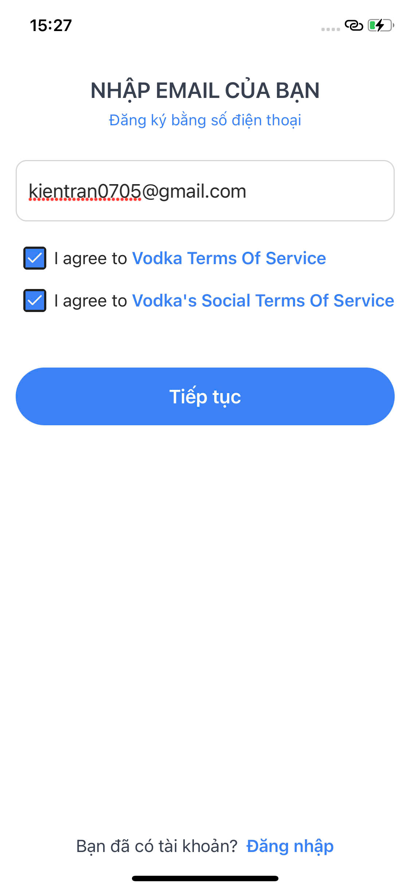
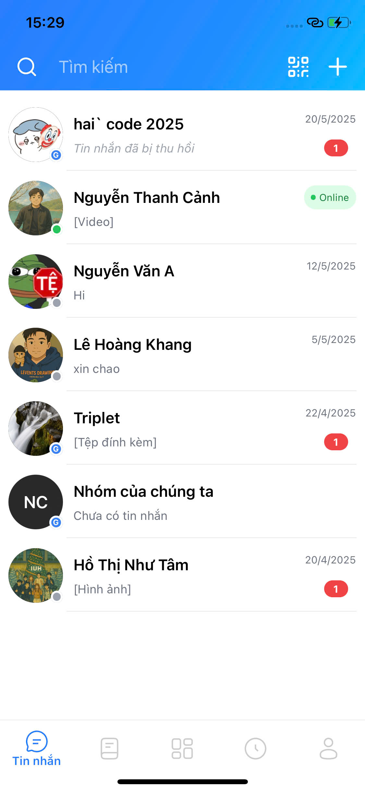
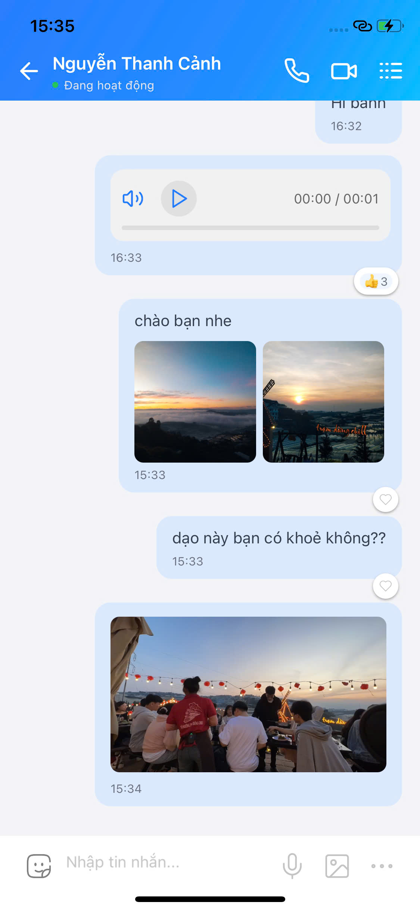
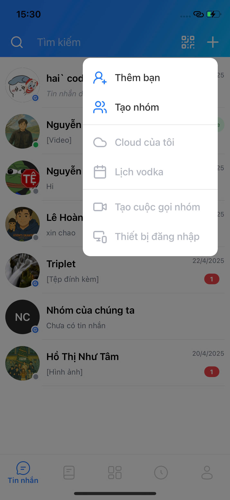
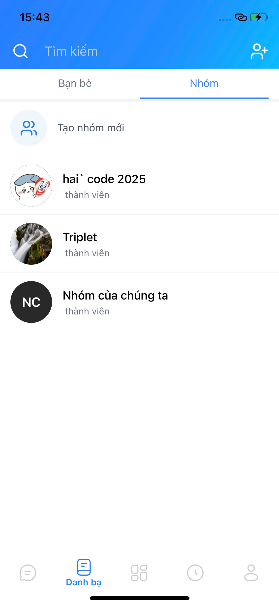

# Vodka - Real-time Mobile Chat Application 🍸

Vodka is a modern, real-time mobile chat application built with Expo, React Native, and TypeScript. It offers seamless communication with features like group chats, direct messaging, and real-time status updates.

## Features ✨

- 💬 Real-time messaging with WebSocket integration
- 👥 Group chat functionality
- 👤 User status indicators
- 🔔 Push notifications
- 🌙 Dark/Light theme support
- 🔒 Secure authentication
- 📱 Cross-platform (iOS & Android)

## Screenshots 📱

<!-- Add your screenshots here -->

### Authentication




### Chat Interface




### Group Features




### User Profile


s

## Tech Stack 🛠

- **Framework**: [Expo](https://expo.dev/)
- **Language**: [TypeScript](https://www.typescriptlang.org/)
- **State Management**: [Zustand](https://github.com/pmndrs/zustand)
- **Real-time Communication**: [Socket.IO](https://socket.io/)
- **UI Components**: Custom components with Tailwind CSS
- **API Client**: [Axios](https://axios-http.com/)

## Getting Started 🚀

### Prerequisites

- Node.js (v16 or higher)
- npm or yarn
- Expo CLI
- iOS Simulator (for Mac) or Android Studio (for Android development)

### Installation

1. Clone the repository

   ```bash
   git clone https://github.com/thanhcanhit/bond-hub-mobile.git
   cd bond-hub-mobile
   ```

2. Install dependencies

   ```bash
   npm install
   ```

3. Start the development server

   ```bash
   npx expo start
   ```

4. Run on your preferred platform
   - Press `i` for iOS simulator
   - Press `a` for Android emulator
   - Scan QR code with Expo Go app for physical device

## Project Structure 📁

```
bond-hub-mobile/
├── app/                 # Main application screens
├── assets/             # Static assets (images, fonts, etc.)
│   ├── fonts/         # Custom fonts
│   └── screenshots/   # App screenshots for documentation
├── components/         # Reusable UI components
├── constants/         # App constants and configurations
├── hooks/             # Custom React hooks
├── lib/               # Core utilities and configurations
├── providers/         # Context providers
├── services/          # API and service integrations
├── store/             # Zustand state management
├── tasks/             # Background tasks
└── types/             # TypeScript type definitions
```

## Contributing 🤝

1. Fork the repository
2. Create your feature branch (`git checkout -b feature/AmazingFeature`)
3. Commit your changes (`git commit -m 'Add some AmazingFeature'`)
4. Push to the branch (`git push origin feature/AmazingFeature`)
5. Open a Pull Request

## License 📝

This project is licensed under the MIT License - see the [LICENSE](LICENSE) file for details.

## Acknowledgments 🙏

- [Expo Team](https://expo.dev/) for the amazing framework
- [Socket.IO](https://socket.io/) for real-time capabilities
- All contributors who have helped shape this project

Project Link: [https://github.com/thanhcanhit/bond-hub-mobile](https://github.com/thanhcanhit/bond-hub-mobile)
